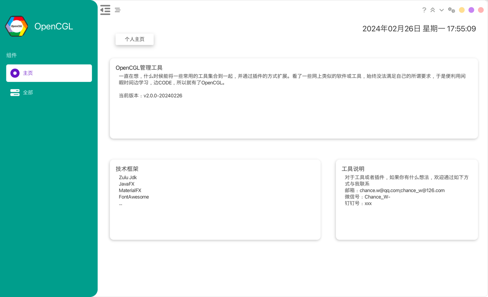

# OpenCGL

## 目录

1. **介绍**
    - 1.1 为什么使用本软件
    - 1.2 主要功能
2. **安装**
    - 2.1 系统需求
    - 2.2 安装步骤
        - windows
        - mac
        - linux
3. **快速开始**
    - 3.1 首次运行
    - 3.2 基本操作
4. **高级功能**
    - 4.1 插件式扩展
5. **常见问题解答**
    - 5.1 暂无
6. **技术支持**
    - 6.1 联系方式
    - 6.2 社区支持

---

## 1. 介绍

### 1.1 为什么使用本软件

#### 插件式管理

工具采用了插件式管理的设计，允许用户根据自己的需求选择和管理各种插件。通过编写符合API文档的插件，用户可以轻松地扩展和定制功能。无论是简单的工具插件还是复杂的应用程序，都能够满足用户的需求。

#### 支持热加载插件

为了提升用户体验和工作效率，工具支持热加载插件。这意味着您可以在不中断工作的情况下动态地添加、删除或更新插件。

#### 跨平台兼容性

具有跨平台兼容性，支持Mac、Linux和Windows操作系统。这意味着无论您使用哪种操作系统，您都可以轻松地访问和管理，无需担心兼容性问题。

#### API文档支持

提供了详细的API文档，帮助用户了解如何编写和管理插件。这些文档清晰地描述了插件开发的各个方面，使得用户可以迅速上手并开始编写自己的插件。

#### 简洁易用的用户体验

注重用户体验，努力为用户提供简洁、直观和易用的界面。设计简洁清晰，使得用户可以轻松地找到并使用各种功能。同时，还提供了详细的帮助文档和技术支持，帮助用户解决问题和提高工作效率。

#### 发现更多可能性

统一管理插件式工具为用户提供了无限的可能性。无论您是个人用户还是企业用户，都可以通过工具实现自己的创意和想法，提高工作效率，实现更多的价值。

### 1.2 主要功能

1. 集成式管理插件
   支持集成式管理插件，使用户能够根据自己的需求轻松地添加、删除和管理各种插件。这种集成式管理方式使得用户能够定制自己的工作环境，以满足不同的工作任务和工作流程。

2. 热加载插件支持
   除了集成式管理插件外，还支持热加载插件功能。这意味着用户可以在不中断工作的情况下动态地添加、删除或更新插件。这种灵活性使得用户能够随时根据需要调整其工作环境，以适应不断变化的工作需求。

3. 跨平台兼容性
   具有跨平台兼容性，支持在Mac、Linux和Windows操作系统上运行。无论用户使用哪种操作系统，他们都可以轻松地访问和管理我们的软件，无需担心兼容性问题。

4. 提升工作效率
   通过集成式管理插件和支持热加载插件，旨在提升用户的工作效率。用户可以根据自己的需求定制和调整其工作环境，减少不必要的重复劳动，提高工作效率。

5. 简单易用的界面
   注重用户体验，致力于为用户提供简单易用的界面。我们的软件设计简洁清晰，使用户可以轻松地找到并使用各种功能。我们还提供了详细的操作指南和技术支持，帮助用户更快地上手并充分发挥软件的功能。

6. 持续不断的版本维护
   支持版本检测更新等，尽其所能的优化和增加新的创意

## 2. 安装

### 2.1 系统需求

支持在Mac、Linux和Windows操作系统上运行

### 2.2 安装步骤

#### windows

双击OpenCGL_xxxx.exe安装即可

#### mac

由于无法申请到苹果的开发者账号，所以当前仅支持通过手工部署的方式操作

1.根据实际自行选择如下 jdk版本
- ARM 64-bit：https://www.azul.com/core-post-download/?endpoint=zulu&uuid=9a813ae9-1c71-4256-ba23-603bacbc355d
- x86 64-bit：https://www.azul.com/core-post-download/?endpoint=zulu&uuid=90273b2e-1850-47a4-95e4-49ff120c120a

2.将其解压至您的软件安装目录

3.软件安装目录新建 OpenCGL目录

4.获取 OpenCGL-Single.jar 放入到新建的OpenCGL目录

5.打开终端
按顺序执行如下命令

```shell
cd 
vi .bashrc
进入编辑模式，尾部输入如下
OPENCGL_HOME=OpenCGL目录的绝对路径

如下../Java/zulu21.30.15/bin/java替换为新安装 java 的对应相对路径或绝对路径都可以
alias opencgl='cd $OPENCGL_HOME;nohup ../Java/zulu21.30.15/bin/java -jar OpenCGL-Single.jar > /dev/null &'

按 esc 保存退出后
执行source .bashrc

后续启动软件直接进入终端，执行 opencgl 即可
```

#### linux

下载 jdk：https://www.azul.com/core-post-download/?endpoint=zulu&uuid=9392659f-d686-4d84-a8a1-995653c19027

其它步骤参考 mac即可

## 3. 快速开始

### 3.1 首次运行

软件主页


### 3.2 基本操作

#### 3.2.1.插件热加载，此处以插件模板为例，某些插件如果运行不正常，请重启应用


您也可以自行指定插件路径，并将插件拖到您的指定路径即可

#### 3.2.2.重新回到操作的 tab 页签


#### 3.2.3.版本更新，分为启动自动检测版本更新和手工检测版本更新（此处只演示点击更新）


#### 3.2.4.菜单回收和展开


## 4. 高级功能

### 4.1 高级功能一

#### 4.1 插件式扩展

见[3.2.1]

## 5. 常见问题解答

暂无

### 5.1 安装问题

暂无

### 5.2 使用问题

暂无

### 5.3 其他问题

暂无

## 6. 技术支持

### 6.1 联系方式

- 邮箱：chance.w@qq.com;chance_w@126.com
- 微信号：Chance_W-
- 钉钉号：xxx

### 6.2 技术框架

- Zulu Jdk
- JavaFX
- MaterialFX
- FontAwesome
- ...

---
