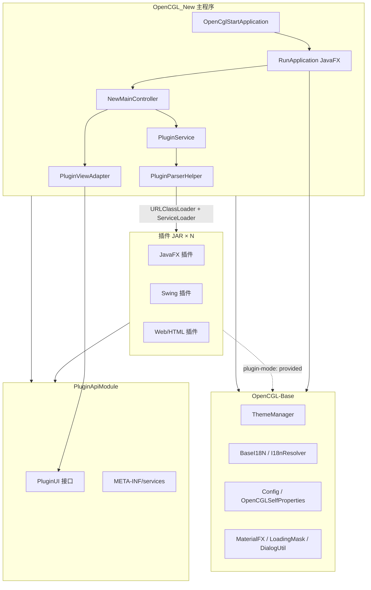

# OpenCGL 项目架构与功能说明

> 文档生成日期：2026-05-25  
> 分析范围：`OpenCGL_New`（主程序）+ `OpenCGL-Plugin-New`（插件生态，含 API / Base / 各功能模块）

---

## 1. 项目概览

**OpenCGL** 是一款基于 **JavaFX + MaterialFX** 的跨平台桌面工具集容器。核心思路是 **插件化架构**：主程序负责壳层 UI、插件加载与生命周期，具体业务能力以独立 JAR 插件形式扩展，支持 **热加载**、**应用市场安装** 与 **自定义 Web 页签**。

| 仓库 | 角色 | 当前版本（pom） |
|------|------|-----------|
| `OpenCGL_New` | 主程序壳（启动、侧栏、Tab、设置、市场） | `2.2.3`   |
| `OpenCGL-Plugin-New/PluginApiModule` | 插件契约 `PluginUI` 等 API | `1.0.0`   |
| `OpenCGL-Plugin-New/OpenCGL-Base` | 公共库（JavaFX、主题、i18n、工具类） | `1.0.0`   |
| `OpenCGL-Plugin-New/*Module` | 约 80+ 功能插件 Maven 子模块 | 各模块独立     |

**运行环境**：JDK 21+，支持 Windows / macOS / Linux 打包（`jpackage` 生成 exe / dmg / rpm|deb）。

---

## 2. 整体架构



### 2.1 插件加载机制

1. 用户在 **设置** 中配置插件目录（`PLUGIN_PATH_KEY`）。
2. `PluginParserHelper.initPluginInfo()` 扫描目录下所有 `.jar`，为每个 JAR 创建 **独立 `URLClassLoader`**（Parent-First 双亲委派）。
3. 通过 Java **`ServiceLoader`** 读取 `META-INF/services/com.opencgl.api.PluginUI`，实例化插件。
4. 用户点击侧栏图标时 **懒加载** 调用 `createView()`；关闭或卸载时调用 `dispose()`。
5. `PluginViewAdapter` 按 `UIType` 适配视图：
   - **JAVAFX** → 直接作为 `Node`
   - **SWING** → `SwingNode` 嵌入
   - **WEB** → `WebView`（支持纯 HTML 或 `WebPluginWithBridge` Java 桥接）

### 2.2 依赖关系

| 组件 | 依赖 Base | 说明 |
|------|-----------|------|
| 主程序 | ✅ compile | 编译并随主程序分发，是 Base 的**唯一运行时提供方** |
| 插件（默认 `plugin-mode`） | ✅ provided | 不打进插件 JAR，运行时共用主程序 Base |
| 插件（`stand-alone-mode`） | ✅ compile | 便于插件单独调试 |

插件若需 Base 之外的第三方库，须自行声明依赖并用 **maven-shade-plugin** 打入单 JAR（主程序按单文件加载）。

---

## 3. 主程序代码结构（OpenCGL_New）

```
OpenCGL_New/
├── pom.xml                          # 构建、jlink 定制 JRE、jpackage 安装包
├── src/main/java/com/opencgl/
│   ├── OpenCglStartApplication.java # main 入口 → Application.launch
│   ├── RunApplication.java          # JavaFX Application：单实例锁、主题、异步加载 Main.fxml
│   ├── controller/
│   │   ├── NewMainController.java # 主界面：侧栏、Tab、插件打开、热刷新、窗口控制
│   │   ├── HomePaneController.java
│   │   ├── GeneralComponentsController.java   # 「全部」插件网格
│   │   ├── PluginMarketController.java        # 应用市场
│   │   ├── CustomPluginsPaneController.java   # 自定义 Web 插件
│   │   ├── CustomPluginEditDialog.java
│   │   ├── adapter/PluginViewAdapter.java     # JAVAFX/SWING/WEB 适配
│   │   ├── handler/ContextMenuHandler.java    # 侧栏/Tab 右键菜单
│   │   └── manager/
│   │       ├── SidebarManager.java            # 侧栏分类与固定入口
│   │       └── HistoryManager.java            # 操作历史 Tab
│   ├── service/
│   │   ├── PluginService.java       # 加载、分组、安装、卸载
│   │   ├── PluginUpdateService.java # 单插件版本检查与更新
│   │   ├── PluginMarketService.java # 多源市场 index 拉取与合并
│   │   ├── PluginClickStore.java    # 点击频次（侧栏排序）
│   │   ├── UpdateService.java       # 主程序版本检查
│   │   └── CustomPluginStorageService.java
│   ├── util/
│   │   ├── PluginParserHelper.java  # ClassLoader 缓存、SPI 加载、失败记录
│   │   ├── LocalPluginIndexGenerator.java
│   │   └── ...
│   ├── selfpane/                    # 自研 UI 组件（Tab、设置、对话框）
│   ├── model/                       # PluginInfo、RemotePluginInfo、CustomPluginEntry 等
│   └── i18n/                        # 主程序中英文
└── src/main/resources/com/opencgl/
    ├── view/                        # Main.fxml、HomePane、PluginMarketPane 等
    ├── css/MainWindow.css
    ├── config/application.properties
    └── i18n/opencgl_zh_CN.properties
```

---

## 4. 主程序内置功能

以下能力由 **主程序自身** 提供，不依赖具体业务插件 JAR。

### 4.1 壳层与导航

| 功能 | 说明 |
|------|------|
| 无边框窗口 | 透明 Stage，自定义标题栏（移动、最大化、全屏、最小化、关闭） |
| 侧栏固定入口 | **主页**、**全部**、**应用市场**、**自定义插件** |
| 插件分类侧栏 | 按 `directoryName()` 分组；支持 `opencgl.category.*` 多语言映射 |
| Tab 多页签 | 多插件并行；支持关闭当前/左侧/右侧/全部、复制 Tab |
| 侧栏收起/展开 | 节省横向空间 |
| 点击频次排序 | `PluginClickStore` 记录常用插件，刷新侧栏时按热度重排 |
| 操作历史 | `HistoryManager`：按日期查看、刷新、清空历史记录 |

### 4.2 插件生命周期

| 功能 | 说明 |
|------|------|
| 扫描与加载 | 启动及「刷新插件」时扫描配置目录 |
| 热加载 | 拖入 JAR 安装到插件目录后刷新，无需重启（部分插件仍建议重启） |
| 安装/覆盖 | 异步复制 JAR，冲突时确认覆盖 |
| 卸载 | 关闭 ClassLoader、删除 JAR（Windows 可能需重启释放句柄） |
| 单插件更新 | 右键「检查更新」，对比远程版本并下载 |
| 加载失败提示 | `lastLoadFailures` 汇总失败 JAR；设置页展示加载状态 |
| 图标管理 | 分类随机图标、固定/刷新/批量解固定（`CategoryIconManager`） |

### 4.3 应用市场

| 功能 | 说明 |
|------|------|
| 多源索引 | 默认 `https://upgrade.tool-graphical.top/OpenCGL/index.json`，可增删 HTTP/HTTPS/`file:///` 源 |
| 多源合并 | 同名插件取最高版本 |
| 搜索与分类筛选 | 网格/列表视图切换 |
| 下载安装 | 进度提示，安装后触发热加载 |
| 导出本地源 | 设置中扫描已装插件生成 `index.json`（离线市场） |
| 源管理对话框 | `RegistryManagerDialog` |

### 4.4 自定义插件（Web）

| 功能 | 说明 |
|------|------|
| 增删改 | 名称、URL/本地路径、可选图标 |
| WebView 打开 | 内置页签展示；复杂 SPA（React/Vue）兼容性有限 |
| 持久化 | `CustomPluginStorageService` 本地存储条目列表 |

### 4.5 全局设置与体验

| 功能 | 说明 |
|------|------|
| 插件路径配置 | 目录选择、一键打开文件夹 |
| 日志级别 | Log4j 动态级别 |
| 语言切换 | 中文 / English（`Language` + `I18N`） |
| 主题切换 | 深色/浅色（`ThemeManager`，与 Base 联动） |
| 主程序更新 | 启动可自动检查；菜单手动检查（`UpdateService` → `version.properties`） |
| 单实例运行 | 文件锁防止重复启动 |
| 帮助链接 | 打开 README 等外部文档 |

### 4.6 开发与构建

| 产出物 | Maven 目标 |
|--------|------------|
| `OpenCGL.jar` + `lib/` | 标准 package |
| `OpenCGL-Single.jar` | assembly 胖 JAR |
| 安装包 | `jlink` 定制 JRE + `jpackage`（exe/dmg/rpm） |

---

## 5. OpenCGL-Base 公共能力

插件与主程序共享的基础库（`com.opencgl.base`）：

| 分类 | 代表类/能力 |
|------|-------------|
| 主题 | `ThemeManager`、`ThemeSwitchUtil`、`CssFileWatcher` |
| 国际化 | `BaseI18N`、`I18nResolver`、`BaseLanguage` |
| UI 组件 | `LoadingMask`、`CustomMFXFilterComboBox`、`OpencglComboBox`、各类 Dialog |
| 配置 | `Config`、`OpenCGLSelfProperties` |
| 网络/脚本 | `MyHttpHandler`、`RequestHook`、`GroovyScriptEngine`、`JavaScriptEngine` |
| 数据/工具 | Hutool、OkHttp、FastJson、SQLite、树形控件工厂、历史记录视图构建器等 |
| 类加载 | `PluginClassLoader`（Base 内工具，与主程序 URLClassLoader 策略配合） |

---

## 6. 插件 API 契约（PluginUI）

```java
public interface PluginUI {
    enum UIType { JAVAFX, SWING, WEB }
    String directoryName();  // 侧栏分类
    String name();           // 显示名（Tab/菜单）
    URL iconPath();          // 可选图标
    UIType type();
    Object createView();     // 懒加载 UI
    default void dispose() {}
    default String version() { ... }
    default String category() { return "其他"; }
    default String description() { return ""; }
}
```

**扩展接口**：

- `PluginI18n`：主程序切换语言时回调插件刷新文案（如 TemplatePlugin3）。
- `ThemeAware`：主题变化通知（如 WhiteboardModule）。
- `WebPluginWithBridge`：WebView 与 Java 双向桥接（TemplatePlugin6）。

**SPI 注册**：`src/main/resources/META-INF/services/com.opencgl.api.PluginUI` 中写实现类全名。

---

## 7. 官方插件清单（按分类）

以下为 `OpenCGL-Plugin-New` 父 POM 中 **已纳入构建** 的模块（共 **83** 个子模块，含 6 个模板 + 77 个功能/演示插件）。显示名称取自各模块 `*_zh_CN.properties` 或源码默认值。

### 7.1 插件开发模板（6）

| 模块 | 显示名称 | UI 类型 | 用途 |
|------|----------|---------|------|
| TemplatePlugin | 插件开发模板1 | JavaFX | 基础 FXML 模板 |
| TemplatePlugin2 | 插件开发模板2 | JavaFX | 主题感知示例 |
| TemplatePlugin3 | 插件开发模板3 (纯净多语言演示) | JavaFX | 不依赖 Base 的 i18n |
| TemplatePlugin4 | 插件开发4-Shade隔离演示插件 | JavaFX | Maven Shade 冲突隔离演示 |
| TemplatePlugin5 | Template 5 - Swing | Swing | SwingNode 嵌入示例 |
| TemplatePlugin6 | Template 6 - 仅 HTML / HTML + Java 桥接 | Web | 纯 HTML 与 Bridge 两种 |

### 7.2 测试工具（15）

| 插件名称 | 模块 |
|----------|------|
| HTTP 请求调试器 | HttpDebuggerModule |
| REST 测试工具 | RestTestModule |
| REST 模拟工具 | RestMockModule |
| Soap 测试工具 | SoapTestModule |
| Dubbo 测试 | DubboServiceTestPlugin |
| Dubbo-SSL 测试工具 | DubboSslTestModule |
| Dubbo Mock Server | DubboMockModule |
| gRPC 测试工具 | GRPCTestModule |
| GraphQL 测试 | GraphQLModule |
| WebSocket 测试 | WebSocketModule |
| MML 测试工具 | MmlTestModule |
| TCP/UDP 小工具 | TcpUdpToolModule |
| Curl 转请求 | CurlToRequestModule |

### 7.3 Mock 模块（1，与上表 Dubbo Mock 重叠统计时可单列）

| 插件名称 | 模块 |
|----------|------|
| REST 模拟工具 | RestMockModule |
| Dubbo Mock Server | DubboMockModule |

### 7.4 运维工具（16）

| 插件名称 | 模块 |
|----------|------|
| Kafka 工具 | KafkaToolModule |
| RMQ-发送者 / RMQ-消费者 | RocketMqToolModule（2 个 PluginUI） |
| 消息追踪工具 | MqTraceModule |
| MongoDB 工具 | MongoDBModule |
| Elasticsearch 工具 | ElasticsearchModule |
| Nacos 配置中心 | NacosModule |
| Docker 管理 | DockerModule |
| 网络诊断 | PortScannerModule |
| Ping/网络探测 | PingScanModule |
| 进程/端口占用 | ProcessPortModule |
| Nginx 配置 | NginxConfigModule |
| 日志查看器 | LogViewerModule |
| Zookeeper 工具 | ZookeeperToolModule |

### 7.5 通用工具集（48+）

| 插件名称 | 模块 |
|----------|------|
| AES 加解密 | AesToolModule |
| RSA 加解密 | RsaToolModule |
| RSA 密钥生成器 | RsaJavaFXModule |
| 加解密控制台 | EncryptAndDecryptModule |
| 哈希计算工具 | HashToolModule |
| JWT 工具 | JWTToolModule |
| Base64 编解码 | Base64ToolModule |
| 文件校验 | FileChecksumModule |
| 报文格式化 | JsonXmlFormatModule |
| JSON/YAML 校验与格式化 | JsonYamlFormatModule |
| YAML 工具 | YamlToolModule |
| SQL 格式化 | SqlFormatterModule |
| SQL 数据库客户端 | SqlClientModule |
| SQL 批量执行 | DbBatchExecModule |
| 数据库匹配执行 | DbMatchExecuteToolModule |
| Redis 管理器 | RedisModule |
| FTP 服务端工具 | FtpToolModule |
| 浏览器工具 | BrowserToolModule |
| 静态文件服务器 | SimpleStaticServerModule |
| 文本对比工具 | DiffToolModule |
| 文本转义工具 | TextEscapeModule |
| 正则工具 | RegexToolModule |
| 时间戳工具 | TimestampToolModule |
| Cron 表达式工具 | CronExpBuilderModule |
| UUID/随机 ID | UuidGeneratorModule |
| 变量生成器 | VariableGeneratorModule |
| QRCode 生成工具 | QRCodeGenerateModule |
| 颜色选择器 | ColorPickerModule |
| 剪贴板历史 | ClipboardHistoryModule |
| 代码片段 | CodeSnippetModule |
| 脚本调试 | ScriptDebugModule |
| Java 代码生成器 | JavaCodeGeneratorModule |
| Java 反编译器 | JavaDecompilerModule |
| 文档转换器 | DocConverterModule |
| Markdown 转换器 | DocToMarkdownModule |
| Markdown 编辑器 | MarkdownEditorModule |
| Editor Experience | EditorExperienceModule |
| 图片转 SVG | ImageSvgModule |
| CSV 表格查看器 | CsvViewerModule |
| Properties 编辑器 | PropertiesEditorModule |
| 数据提取器 | DataExtractorModule |
| JSON/XML Path 提取器 | PathExtractorModule |
| 批量文件重命名 | BatchRenamerModule |
| 屏幕尺子与取色器 | PixelRulerModule |
| 流程图画板 | WhiteboardModule |
| AI 问答 | AiQaModule |
| 局域网通讯 | LanMessengerModule |
| Git 工具 | GitLiteModule |
| SSH 终端 | SshTerminalModule |
| 环境变量/系统属性 | EnvVarsModule |
| HTTPS 证书生成器 | CertGeneratorModule |

### 7.6 仓库内未编入父 POM 的模块

| 模块 | 说明 |
|------|------|
| `SshJediTermModule` | 存在独立 `pom.xml`（SSH 终端 java 版），未列入 `com.opencgl.plugin` 的 `<modules>`，需单独构建 |
| `PluginApiModule` / `OpenCGL-Base` | 基础 artifact，非功能插件 |

---

## 8. 插件分类统计

| 分类（directoryName） | 约计插件数 |
|----------------------|------------|
| 通用工具集 | 48+ |
| 运维工具 | 16（含 RocketMQ 双入口） |
| 测试工具 | 15 |
| Mock 模块 | 2 |
| 插件开发模板 | 6～8（Template6 双入口） |

侧栏分类中文显示可在主程序 `opencgl_zh_CN.properties` 中通过 `opencgl.category.<分类名>` 配置；当前已配置：**插件模板**、**其他**。

---

## 9. 技术栈汇总

| 层次 | 技术 |
|------|------|
| 语言 / 运行时 | Java 21 |
| UI 框架 | JavaFX 21、MaterialFX 11、CSSFX、Ikonli / FontAwesome |
| 插件机制 | SPI（ServiceLoader）、URLClassLoader、PF4J 风格隔离思路 |
| 构建 | Maven 3.6+、maven-shade-plugin（重型插件）、jlink、jpackage |
| 网络 / 工具库 | Hutool、OkHttp、FastJson、Log4j / SLF4j |
| 测试 | JUnit 5、Mockito（主程序含少量单测） |

---

## 10. 典型使用流程

1. **首次启动** → 设置中选择插件 JAR 目录 → 将插件放入目录或从市场安装。  
2. **日常使用** → 侧栏选分类 → 点击工具图标 → Tab 中打开；可从「全部」网格或搜索进入。  
3. **扩展** → 按 `开发手册.md` 实现 `PluginUI` + SPI → `mvn package` → JAR 复制到插件目录 → 主程序「刷新插件」。  
4. **构建主程序** → 先 `OpenCGL-Base` 执行 `mvn install`，再 `OpenCGL_New` 执行 `mvn package`（可选 `-P windows|mac|linux`）。

---

## 11. 相关文档

| 文档 | 路径 |
|------|------|
| 用户 README | `OpenCGL_New/README.md` |
| 插件开发手册 | `OpenCGL_New/开发手册.md` |
| 插件仓库说明 | `OpenCGL-Plugin-New` 各模块 README |

---

## 12. 总结

OpenCGL 采用 **「轻量主程序 + 重量级插件生态」** 的分层设计：主程序聚焦 **导航、Tab、插件 ClassLoader、市场、主题与 i18n**；业务以 **80+ 官方插件模块** 覆盖开发、测试、运维、加解密、文档、数据库、消息队列等场景。扩展时只需遵循 `PluginUI` 契约并注册 SPI，即可与现有热加载、市场分发体系无缝集成。
